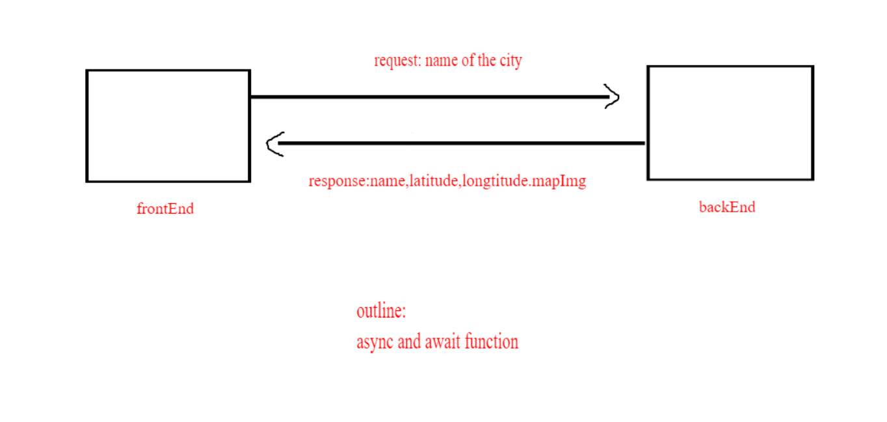

# Project Name node and express 
 **Author**:ahmad abuteifor
**Version**: 1.0.0 (increment the patch/fix version number if you make more commits past your first submission)

## Overview
bulding a appliction that let the others get the loction and the wether and the movie depend in the name of the city and lat and lon 

## Getting Started
 1- Creating Repo 2- Creating react app   3-Use API to request and take DAta from 4-Making API useing express and node js 5- install nodemon  6- using api for move and weatherbit 7- installl dontev and other packege 

 ## Architecture
i used the react app , bootstrab ,node js 

## Credit and Collaborations
Ammani musa 
helped from TAs 
asle w3school 

Name of feature: using the URL

Estimate of time needed to complete: __3 hours___

Start time: _1pm ____

Finish time: _5pm ____

Actual time needed to complete: ___4 hours__

i worked from 2 pm to 8 pm 

somt time i worked in the night 